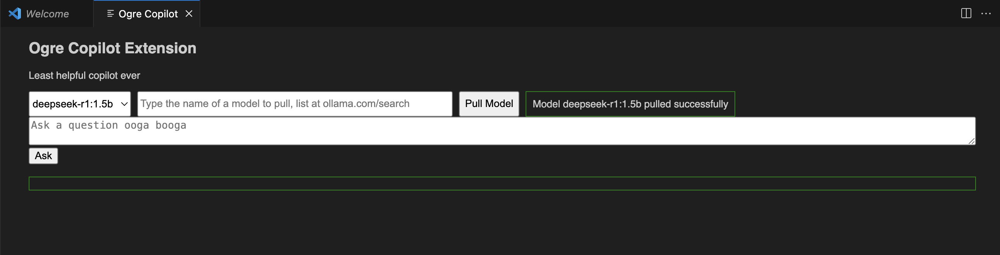

# ogre-copilot README

A free and open-source VSCode extension giving users an option to use a selection of LLM coding assistants.

Lowkey useless because Github Copilot is free, but this will eventually be updated to allow use for a more diverse spread of models.

## Features

Use `>ogre-copilot.start` to open the chat window.



* change the selected model using the dropdown
* pull any model from https://ollama.com/search to use

## Requirements to run

Need to install dependencies:

```
npm install
```

Then to run the extension, first compile the typescript:

```
tsc
```

Then just run the debugger to open a new VSCode window running the extension.

## References

Got the core extension code & idea from this video by Fireship:

https://www.youtube.com/watch?v=clJCDHml2cA